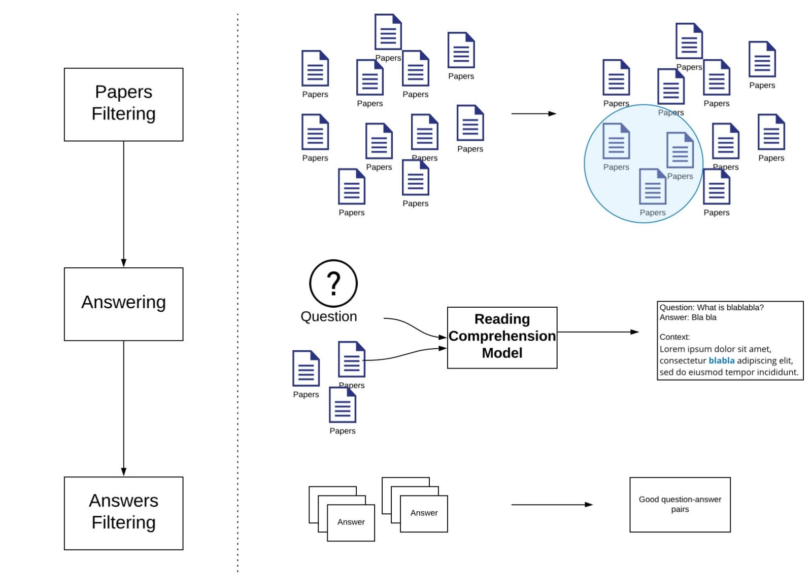

# Readme

## Overview
This is the repository for Covid-19 question answering on academic publication based on [COVID-19 Open Research Dataset Challenge (CORD-19)](https://www.kaggle.com/allen-institute-for-ai/CORD-19-research-challenge) . This python project uses [spaCy](https://spacy.io/) and [AllenNLP](https://allennlp.org/) library. We use three steps pipeline as shown in the following figure.

## Filtering Papers 
To run paper filtering, run the following:
> python PaperFilter.py <path_to_dataset> <path_to_keyword_file> <output_file_name> <similarity_threshold>

* The dataset directory should be the root directory of Kaggle CORD-19 dataset. 
* Keyword file is a txt file containing a single keyword each line. 
* Similarity threshold should be a real number between 0 and 1. Higher threshold implies stricter filter.
* This execution results in a single pickle file containing a DataFrame of papers related to the keywords.

## Running Reading Comprehension
To run Reading Comprehension run the following:
> python ReadingComprehension.py <path_to_related_paper_pickle_file> <path_to_question_file> <output_dir>

* Path to related papers is the path to the pickle file produced by executing PaperFilter.py.
* Question file is a txt file containing a single question each line.
* This script result in a single pickle file for each question pair stored in output_dir

## Answer Filtering
A pickle file from ReadingComprehension.py contains a dataframe that can be read usign [pandas.read_pickle](https://pandas.pydata.org/pandas-docs/stable/reference/api/pandas.read_pickle.html).